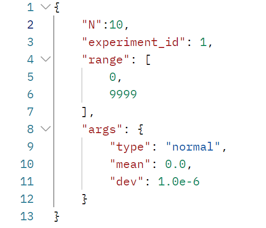
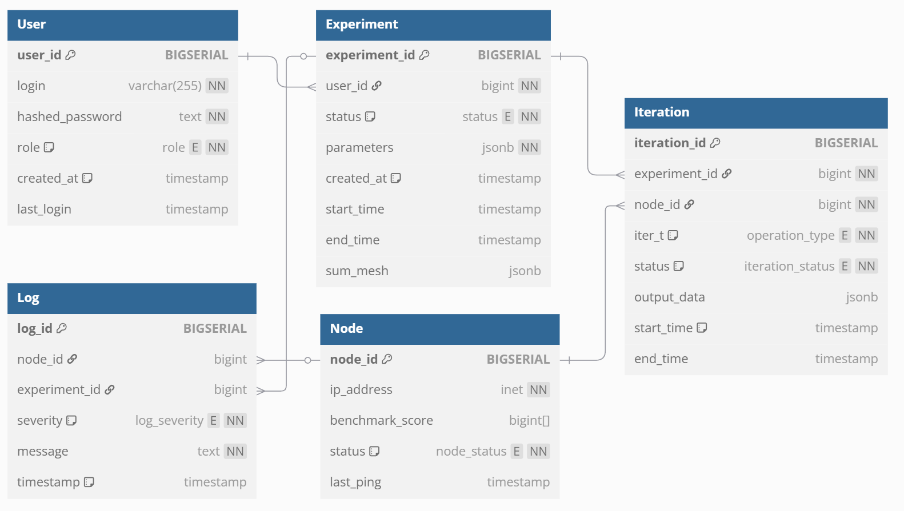
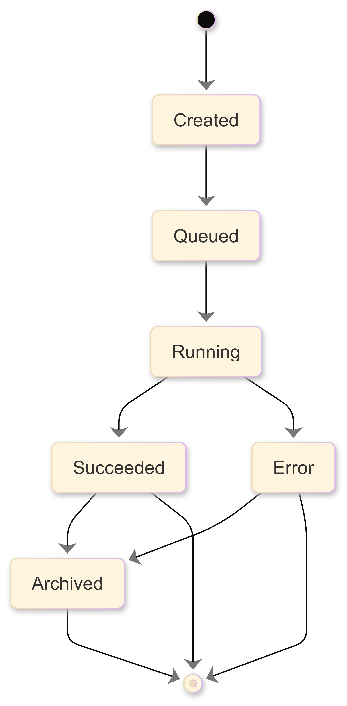

[К содержанию](DocPage.md)

# Архитектура проекта

Система получает от пользователя параметры для серии вычислительных экспериментов.
Серия экспериментов в данной системе задаётся структурой JSON представление, которой можно найти ниже.

У каждой серии экспериментов помимо параметров указан диапазон для итераций.  

С учётом особенностей математической модели из главы 2 все вычисления в данных итерациях будут независимы между собой,
что позволяет эффективно распределять их как между несколькими потоками, так и несколькими узлами.
На основании этого планировщик задач производит разбиение серии экспериментов на набор блоков и отправляет
эти блоки в очереди сообщений рабочих узлов для исполнения.  

Рабочие узлы асинхронно считывают фрагменты задач из очередей и производят необходимые математические преобразования, параллельно записывая необходимые результаты в БД.
После вычисления всех итераций серия экспериментов переводиться в статус завершённой и пользователь может подгрузить данные о ней через GUI.

На данный момент система имеет следующую структуру сущностей и связей:

На данной диаграмме присутствует следующий набор сущностей:
1.	**Серия экспериментов (Experiment)** – является основной сущностью, для описания параметров приводимой серии экспериментов. Ключевыми для разбиения являются параметры N (размер системы) и iter_n (число итераций). Часть из JSON параметров могут быть использованы программой моделирования для настройки работы некоторых её компонентов.
2.	**Итерация серии экспериментов (Iteration)** – содержит данные об исполнении одной из итераций выделенной серии экспериментов. Основной является информация о серии экспериментов, типе итерации, а также её статусе. При небольших модификациях позволит хранить результаты довольно широкого круга вычислительных процедур.
3.	**Вычислительный узел (Node)** – содержит сведенья о вычислительных узлах, которые ранее подключались к системе. При запросе система сможет синхронизировать текущий набор узлов с активным набором узлов из БД.
4.	**Пользователь (User)** – определяет набор учётных данных, характеризующих пользователя системы. Пользователь может иметь как базовый набор привилегий: создавать/отправлять серии экспериментов, просматривать отчёты о своих сериях экспериментов, так и продвинутый с большим набором возможностей, которые доступны только системному администратору.
5.	**Журнал логгирования (Log)** – содержит все записи о событиях, происходящих в системе.

Модель данных спроектирована с учётом возможного расширения для поддержки новых вычислительных операций. 
Основная информация хранится в таблицах Experiment и Iteration, что обеспечивает гибкость и масштабируемость системы.
У серии экспериментов существует свой набор состояний. Для большей наглядности жизненный серии экспериментов приведён ниже:

Жизненный цикл серии экспериментов включает следующий набор статусов:
1.	**Создана (Created)** – задача создана и готова к отправке. Задача только что создана пользователем и готова к отправке в систему для дальнейшей обработки.
2.	**В очереди (Queued)** – задача в очереди на выполнение. Она находится в очереди, пока система не выделит ресурсы для её запуска.
3.	**Выполняется (Running)** – задача выполняется. Это состояние, когда система запустила задачу, и её итерации находятся в процессе обработки.
4.	**Успешно завершена (Succeeded)** – задача успешно завершена. Все итерации выполнены успешно, и цель задачи достигнута.
5.	**Завершена с ошибкой (Error)** – задача завершена с ошибкой. Хотя бы одна из итераций не была выполнена успешно, что привело к сбою.
6.	**Архивирована (Archived)** – данные сохранены, активность завершена. Данные задачи сохранены (например, выгружены), и в системе осталась только основная запись о задаче.

В рамках данного жизненного цикла серия экспериментов получает статус Created после своего создания. Пользователь может менять её параметры перед отправкой на исполнения. После отправки данной серии экспериментов она приобретает статус Queued и после разбиения на блоки итераций отправляются в очереди для вычислительных узлов. После начала выполнения итераций её статус меняется на Running и далее в зависимости от исхода приобретает статус либо Error, либо Succeeded. Данные о серии экспериментов, в частности результаты промежуточных операций, можно выгрузить и в таком случае задач приобретёт статус Archived, а данные о её итерациях будут выгружены в удобном формате.

