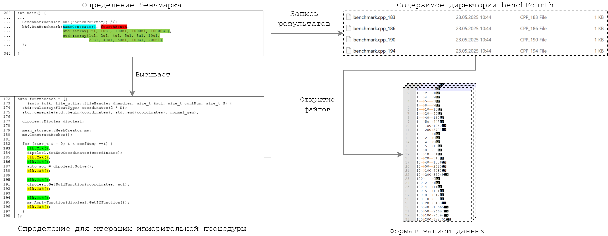

[К содержанию](DocPage.md)

# Описание бенчмарков

Измерение производительности реализации является важным мероприятием при оценке её производительности.

В рамках данного проекта вычислительная процедура будет содержать следующие фрагменты:
1. Построение СЛАУ по входному массиву координат
2. Решение СЛАУ.
3. Построение двухмерной сетки для целевой функции.

Для упрощения измерительных мероприятий был реализован набор классов, который позволяет автоматизировать
процесс создания бенчмарков на основании выбранных массивов входных параметров.
На рисунке приведена диаграмма, описывающая процесс создания нового бенчмарка.

<title>ass</title>

Сам бенчмарк состоит из:
1. определения измеряемой процедуры
2. определения функции для преобразования входных параметров к тексту
3. кода для запуска с входными диапазонами для параметров

В результате его запуска будет создана отдельная директория с файлами измерений.
Для каждой пары tik/tak утверждений будет создан отдельный файл с записями времени исполнения данного диапазона.

На данный момент реализованы следующие бенчмарки:
1. Бенчмарк для оценки времени исполнения различных реализаций целевой функции в однопоточном режиме.
2. Бенчмарк для оценки времени исполнения фрагментов целевой процедуры для 10000 итераций.
3. Бенчмарк для оценки времени исполнения различных реализаций целевой функции в многопоточном режиме.
4. Бенчмарк для оценки времени исполнения фрагментов целевой процедуры для различного числа итераций.
5. Бенчмарк для оценки прироста производительности вычислительной процедуры с ростом числа openmp потоков.

- [ ] результаты