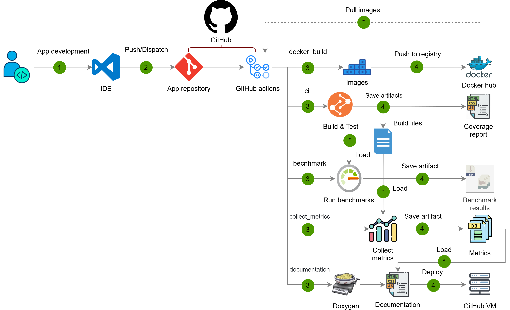

[К содержанию](DocPage.md)

# Внедрённые качественны практики

Внедрение подобных практик связано с большой длительностью проекта и высокой волатильностью проектных требований.
Разработка данного проекта проходила в условиях высокой интенсивности изменений.
Постоянные изменения в течение данного продолжительного интервала неизбежно приводят к возникновению багов,
регрессии модулей, нарушениям в стиле кода и общей структуре абстракций проекта,
что значительно усложняет процесс сопровождения и модификации данного проекта.

Для того чтобы избежать подобных ситуаций было принято решение внедрить и автоматизировать ряд CI/CD процедур.
CI/CD методология содержит набор процессов непрерывной интеграции и непрерывного развёртывания.
Перечень автоматизированных практик описан ниже:

Рассмотрим описание и назначение данных сценариев:
1.	**docker_build**. Данный сценарий позволяет автоматизировать процесс сборки и отправки Docker образов в
репозиторий. Эти образы впоследствии используются другими workflow, либо в качестве среды для исполнения,
либо как стандартный контейнер для зависимостей. Использует матрицу изменённых файлов, для того чтобы определить
перечень образов, которые следует обновить.
2.	**сi**. Является основным сценарием для проверки качества полученного решения.
Данный сценарий производит сборку всего проекта, сохраняя полученный результат сборки в качестве артефакта.
Затем производиться запуск всех тестов вместе в используемыми сервисами.
Результатом такого запуска является отчёт о прохождении серии тестов, а также отчёт о покрытие кода в формате HTML.
Отчёт о покрытие кода также сохраняется в виде отдельного артефакта.
3.	**benchmark**. Данный сценарий предназначен для организации серий измерительных мероприятий,
направленных на оценку производительности компонентов системы. В рамках автоматизации данной
процедуры был реализован функционал для создания бенчмарков для отдельных фрагментов исходного кода,
что значительно ускоряет процесс разработки новых процедур для измерения производительности.
4.	**collect_metrics**. Эта процедура запускает набор инструментов статического анализа кода и логов
сборки для сбора набора метрик, Применяемый набор инструментов позволяет отслеживать набор глобальных 
характеристик кодовой базы, оценка которых вручную являлась бы чрезмерной трудоёмкой.
Собранные метрики можно использовать для того, чтобы отслеживать общее состояние кодовой базы,
и чтобы выявлять дефекты стиля и глобальной структуры проекта.
5.	**documentation**. Данная процедура предназначена для сборки и развёртывания Doxygen
документации на базе GitHub pages. Открытая и доступная документация позволит упростить
процесс навигации по кодовой базе, а также сделать код проекта более простым для восприятия.

# Результаты внедрения практик

| Практика                         | До автоматизации                            | После автоматизации                                 |
| -------------------------------- | ------------------------------------------- | --------------------------------------------------- |
| Docker-образы & унификация среды | Проверка целостности среды вручную: ~4–5 ч. | Автоматическая проверка целостности среды : ~5 мин. |
| CI-тестирование                  | Время обнаружения крит.  ошибок:~1 неделя   | Время обнаружения крит.  ошибок: ~1 ч.              |
| Бенчмарки производительности     | Создание нового бенчмарка: ~5 ч.            | Создание нового бенчмарка: ~15 мин.                 |
| Сбор метрик кода                 | Сбор одной метрики: ~1 ч.                   | Сбор всех метрик: ~30 сек.                          |
| Генерация документации (Doxygen) | Ручная сборка документации: >7 ч.           | Автоматическая сборка документации: ~5 мин.         |
